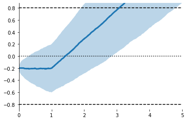
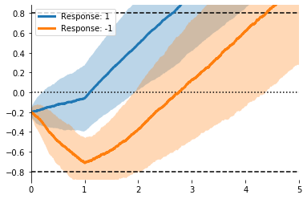
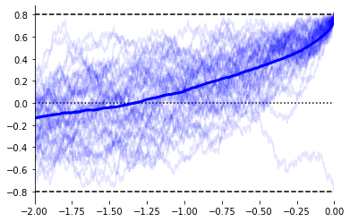
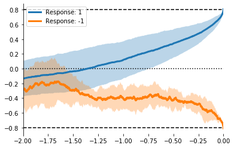
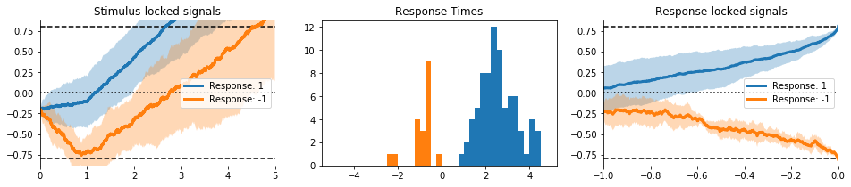
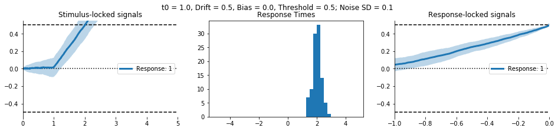
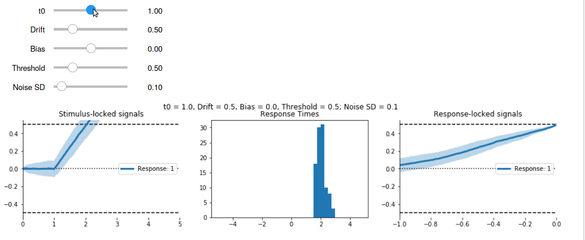

# Evidently: Simulate Evidence Accumulation Models in Python

`Evidently` is a python package for working with evidence accumulation models.

It provides

- Efficient functions for simulating data from a range of models.
- Classes that make it easier to tweak model parameters and manage simulated data.
- A consistent way to implement new models.
- Visualisation, including interactive widgets for Jupyter.
- Kernel density-based methods for estimating 
  the likelihood of real data under a given model/set of parameters,
  allowing parameter estimation and model comparision.

To see some of the features of Evidently in action,
click the link below to launch a notebook packed full of interactive visualisations.

[](https://mybinder.org/v2/gh/EoinTravers/Evidently/master?filepath=notebooks%2FInteractive%20Models.ipynb)

## Installation

Evidently isn't on PyPI yet, but you can install it directly from GitHub:

`pip install git+https://github.com/EoinTravers/Evidently`

## Basic Use


```python
import pandas as pd
import numpy as np
import matplotlib.pyplot as plt
import evidently
```

## Set up a model and provide parameters


```python
model = evidently.models.Diffusion(pars=[1., .5, -.25, .8, .4], max_time=5., dt=.001)
model
```


    Classic Drift Diffusion Model
    Parameters: [t0 = 1.00, v = 0.50, z = -0.25, a = 0.80, c = 0.40]


```python
model.describe_parameters()
```

    Parameters for Classic Drift Diffusion Model:
    - t0   : 1.00  ~ Non-decision time
    - v    : 0.50  ~ Drift rate
    - z    : -0.25 ~ Starting point
    - a    : 0.80  ~ Threshold (±)
    - c    : 0.40  ~ Noise SD


## Simulate data


```python
X, responses, rts = model.do_dataset(n=1000)
```


```python
X.head()
```


<div>
<style scoped>
    .dataframe tbody tr th:only-of-type {
        vertical-align: middle;
    }

    .dataframe tbody tr th {
        vertical-align: top;
    }

    .dataframe thead th {
        text-align: right;
    }
</style>
<table border="1" class="dataframe">
  <thead>
    <tr style="text-align: right;">
      <th></th>
      <th>0.000</th>
      <th>0.001</th>
      <th>0.002</th>
      <th>0.003</th>
      <th>0.004</th>
      <th>0.005</th>
      <th>0.006</th>
      <th>0.007</th>
      <th>0.008</th>
      <th>0.009</th>
      <th>...</th>
      <th>4.990</th>
      <th>4.991</th>
      <th>4.992</th>
      <th>4.993</th>
      <th>4.994</th>
      <th>4.995</th>
      <th>4.996</th>
      <th>4.997</th>
      <th>4.998</th>
      <th>4.999</th>
    </tr>
    <tr>
      <th>sim</th>
      <th></th>
      <th></th>
      <th></th>
      <th></th>
      <th></th>
      <th></th>
      <th></th>
      <th></th>
      <th></th>
      <th></th>
      <th></th>
      <th></th>
      <th></th>
      <th></th>
      <th></th>
      <th></th>
      <th></th>
      <th></th>
      <th></th>
      <th></th>
      <th></th>
    </tr>
  </thead>
  <tbody>
    <tr>
      <th>0</th>
      <td>-0.207292</td>
      <td>-0.195330</td>
      <td>-0.189456</td>
      <td>-0.207362</td>
      <td>-0.203131</td>
      <td>-0.209652</td>
      <td>-0.201883</td>
      <td>-0.216559</td>
      <td>-0.224473</td>
      <td>-0.211417</td>
      <td>...</td>
      <td>2.886206</td>
      <td>2.886012</td>
      <td>2.871632</td>
      <td>2.870360</td>
      <td>2.846827</td>
      <td>2.854295</td>
      <td>2.854028</td>
      <td>2.899442</td>
      <td>2.906381</td>
      <td>2.917107</td>
    </tr>
    <tr>
      <th>1</th>
      <td>-0.201057</td>
      <td>-0.194829</td>
      <td>-0.190369</td>
      <td>-0.204401</td>
      <td>-0.211715</td>
      <td>-0.223547</td>
      <td>-0.223436</td>
      <td>-0.229830</td>
      <td>-0.228947</td>
      <td>-0.200351</td>
      <td>...</td>
      <td>0.563363</td>
      <td>0.546944</td>
      <td>0.535339</td>
      <td>0.526217</td>
      <td>0.523513</td>
      <td>0.525713</td>
      <td>0.529461</td>
      <td>0.544851</td>
      <td>0.539877</td>
      <td>0.538094</td>
    </tr>
    <tr>
      <th>2</th>
      <td>-0.199180</td>
      <td>-0.192633</td>
      <td>-0.185509</td>
      <td>-0.168731</td>
      <td>-0.174054</td>
      <td>-0.173817</td>
      <td>-0.182057</td>
      <td>-0.181962</td>
      <td>-0.192889</td>
      <td>-0.157841</td>
      <td>...</td>
      <td>2.501043</td>
      <td>2.500121</td>
      <td>2.487202</td>
      <td>2.492311</td>
      <td>2.480312</td>
      <td>2.482806</td>
      <td>2.489521</td>
      <td>2.481254</td>
      <td>2.479215</td>
      <td>2.464364</td>
    </tr>
    <tr>
      <th>3</th>
      <td>-0.207049</td>
      <td>-0.230524</td>
      <td>-0.223886</td>
      <td>-0.228257</td>
      <td>-0.221087</td>
      <td>-0.224099</td>
      <td>-0.236907</td>
      <td>-0.238688</td>
      <td>-0.231143</td>
      <td>-0.248498</td>
      <td>...</td>
      <td>2.188082</td>
      <td>2.181968</td>
      <td>2.201805</td>
      <td>2.205892</td>
      <td>2.204378</td>
      <td>2.222228</td>
      <td>2.250239</td>
      <td>2.251298</td>
      <td>2.273741</td>
      <td>2.270209</td>
    </tr>
    <tr>
      <th>4</th>
      <td>-0.218699</td>
      <td>-0.202019</td>
      <td>-0.205839</td>
      <td>-0.192008</td>
      <td>-0.179896</td>
      <td>-0.181002</td>
      <td>-0.198876</td>
      <td>-0.190790</td>
      <td>-0.175592</td>
      <td>-0.190891</td>
      <td>...</td>
      <td>3.363507</td>
      <td>3.372508</td>
      <td>3.387018</td>
      <td>3.409127</td>
      <td>3.388889</td>
      <td>3.363482</td>
      <td>3.363401</td>
      <td>3.364192</td>
      <td>3.370832</td>
      <td>3.392171</td>
    </tr>
  </tbody>
</table>
<p>5 rows × 5000 columns</p>
</div>


```python
print(responses[:5]) 
print(rts[:5])
```

    [1. 1. 1. 1. 1.]
    [1.622 3.958 1.902 3.537 1.974]


## Visualise

The `evidently.viz` submodule contains a collection of `matplotlib`-based functions for visualising model simulations. Here are a few examples.


```python
ax = evidently.viz.setup_ddm_plot(model) # Uses model info to draw bounds.
evidently.viz.plot_trace_mean(model, X, ax=ax); # Plots simulations
```





```python
ax = evidently.viz.setup_ddm_plot(model)
evidently.viz.plot_traces(model, X, responses, rts, ax=ax, 
                          terminate=True, show_mean=True); # Show raw data
```

    /home/eoin/miniconda3/lib/python3.7/site-packages/evidently/viz.py:162: RuntimeWarning: invalid value encountered in greater
      X.iloc[i, t > rt] = np.nan


```python
ax = evidently.viz.setup_ddm_plot(model)
for resp in [1, -1]:
    mask = (responses == resp) # Split by response
    evidently.viz.plot_trace_mean(model, X[mask], ax=ax, label='Response: %i' % resp)
plt.legend();
```





```python
mX = evidently.utils.lock_to_movement(X, rts, duration=2) # Time-lock to threshold crossing
ax = evidently.viz.setup_ddm_plot(model, time_range=(-2, 0))
evidently.viz.plot_traces(model, mX, responses, rts, ax=ax, show_mean=True);
```





```python
ax = evidently.viz.setup_ddm_plot(model, time_range=(-2, 0))
for resp in [1, -1]:
    mask = responses == resp
    resp_mX = evidently.utils.lock_to_movement(X[mask], rts[mask])
    evidently.viz.plot_trace_mean(model, resp_mX, ax=ax, label='Response: %i' % resp)
plt.legend();
```





There high-level functions can create multi-axis figures.


```python
evidently.viz.visualise_model(model, model_type='ddm', measure='means');
```





## Interactive Visualisation

Using the `ipywidgets` package, we can wrap high level visualisation functions like `accum.viz.visualise_ddm` in a call to `ipywidgets` to make them interactive.

To try the interactive plots, download this repository to your own computer,
or run the code in the cloud by visiting [this Binder notebook](https://mybinder.org/v2/gh/EoinTravers/Evidently/master?filepath=notebooks%2FInteractive%20Models.ipynb).

[](https://mybinder.org/v2/gh/EoinTravers/Evidently/master?filepath=notebooks%2FInteractive%20Models.ipynb)


```python
from ipywidgets import interact, FloatSlider
def fs(v, low, high, step, desc=''):
    return FloatSlider(value=v, min=low, max=high, step=step, description=desc, continuous_update=False)

def ddm_simulation_plot(t0=1., v=.5, z=0., a=.5, c=.1):
    model = evidently.Diffusion(pars=[t0, v, z, a, c])
    evidently.viz.visualise_model(model)
    title = 't0 = %.1f, Drift = %.1f, Bias = %.1f, Threshold = %.1f; Noise SD = %.1f' % (t0, v, z, a, c)
    plt.suptitle(title, y=1.01)

interact(ddm_simulation_plot,
         t0  = fs(1., 0, 2., .1,   't0'),
         v   = fs(.5, 0, 2., .1,   'Drift'),
         z   = fs(0., -1., 1., .1,  'Bias'),
         a     = fs(.5, 0., 2., .1,   'Threshold'),
         c   = fs(.1, 0., 1., .1,   'Noise SD'));
```





<!-- This will work once we run gen_readme.sh -->


# Other Models

The following model classes are currently available:

- Diffusion
- Wald
- HDiffision (Hierarchical Diffusion)
- HWald (Hierarchical Wald)
- Race

See the [API](http://eointravers.com/code/evidently/api.html) for more details.

# Road Map


## More Models!

I have already implemented several of these models, but have to integrate them with the rest of the package.

- Leaky Competing Accumulator model.
- LCA/Race models with > 2 options.
- Leaky/unstable Diffusion.
- Time-varying parameters, including
    - Collapsing decision bounds
    - Time-varying evidence
- Hierarchical models with regressors that differ across trials.

## Reparameterisation

Ideally, parameterisation with other packages used for fitting accumulator models 
such as [HDDM](http://ski.clps.brown.edu/hddm_docs/) and
[PyDDM](https://pyddm.readthedocs.io/en/latest/), (for Python) 
and [rtdists](https://github.com/rtdists/rtdists) and 
[DMC](http://www.tascl.org/dmc.html) (for R). 
This would make it possible to efficiently fit models using those packages, 
then explore their dynamics here.

Model probably should also specify default parameters.

##  Visualisation

There's no shortage of ways to visualise accumulator models. 
Future versions will include both more low-level plotting functions
and high-level wrappers.

I'll also be implementing vector field plots, e.g. Figure 2 of 
[Bogacz et al. (2007)](https://people.socsci.tau.ac.il/mu/usherlab/files/2014/03/m2.pdf).

## Likelihood


The `evidently.likelihood` model contains functions for estimating 
the likelihood of data $x$ under parameters $\theta$ and model $M$,
based on the "likelihood-free" technique introduced by 
[Turner and Sederberg (2007)](https://link.springer.com/article/10.3758/s13423-013-0530-0).
These functions aren't properly tested yet,
and haven't been documented.
